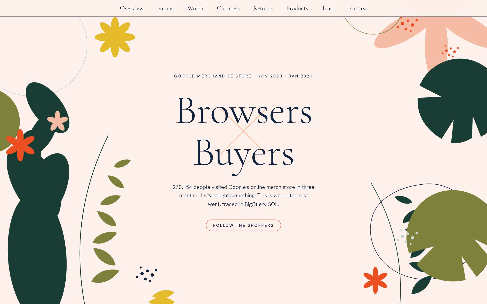
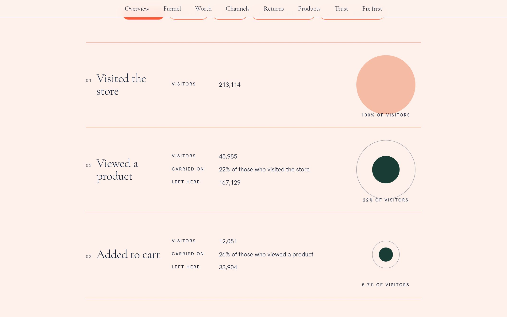
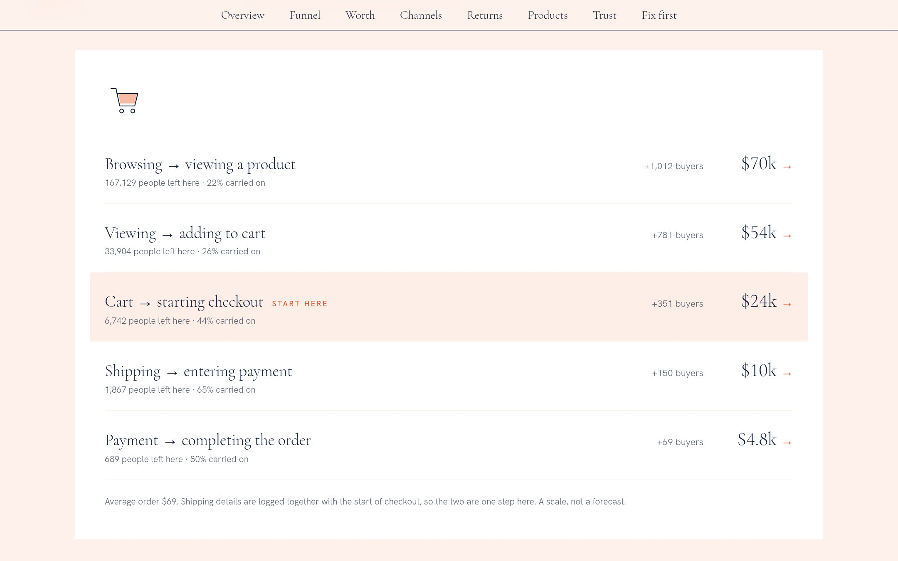
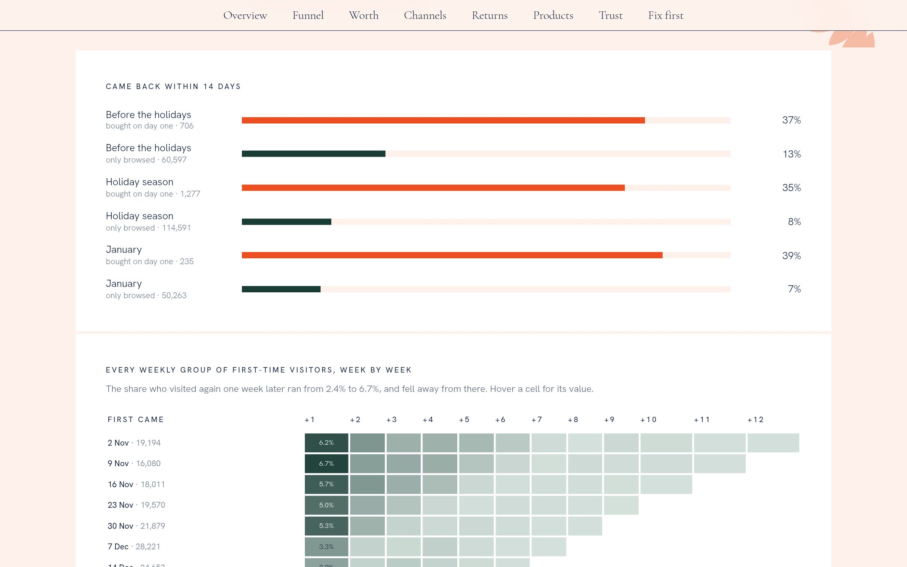
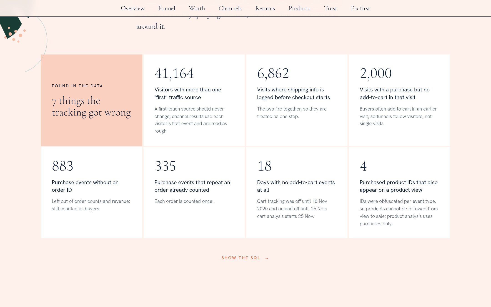
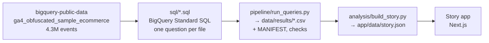

<div align="center">

# Browsers × Buyers

**Where does the Google Merchandise Store lose its shoppers?**

Three months of Google Analytics 4 events from Google's own online store,<br>
followed visitor by visitor in BigQuery SQL, and told as a story.

### [**Read the story →**](https://ga4-ecommerce-funnel.vercel.app)

<a href="https://ga4-ecommerce-funnel.vercel.app"></a>

</div>

---

Google sells hoodies, mugs and stickers in its own online store, and publishes three months of that store's
Google Analytics 4 data in BigQuery for anyone to query: every page view, every cart, every order,
4,295,584 events from 270,154 visitors between November 2020 and January 2021.

Most visitors leave without buying. That is normal. This project asks the four questions an analyst on the
store's team would be asked: **where do shoppers drop out, which traffic brings buyers, do people come
back, and what should the store fix first?** Every number comes from a SQL query, and the queries are on
the page under each chart.

## What it found

1. **Most of the loss happens before anyone shops.** Of 213,114 visitors from 25 Nov to 31 Jan, 78% never
   opened a product page, 74% of product viewers didn't add anything to their cart, and 56% of carts were
   abandoned before checkout. Once people start paying, 80% finish.
2. **The cart is where to start.** Winning back 1 in 10 of the people who leave at each step would have been
   worth about $70k (getting browsers to products), $54k (views to carts), **$24k (carts to checkout)**, $10k
   and $5k over those ten weeks. The top two are about getting people interested at all; the cart is where
   interested people are lost, and it is the most fixable.
3. **Device doesn't matter; season does.** Desktop and mobile visitors buy at almost the same rate (1.35% and
   1.42%). Holiday-season visitors were more than twice as likely to buy as January ones.
4. **Buyers come back; browsers don't.** 35–39% of people who bought on their first day returned within two
   weeks, against 7–13% of those who only browsed. Holiday browsers were the least likely to return (8%).
5. **Apparel is 47% of revenue**, more than the next nine categories together.
6. **No traffic source stands out**, and this data can't rank them: conversion runs from 1.3% to 1.5%
   across channels, and 15% of visitors carry more than one "first" traffic source, which real tracking
   never would. A first draft that picked one source at random made paid search look worst. It wasn't.

## The data is messy, and that's part of the work

Each of these was found by querying the data (`sql/09_data_quality.sql`), and each analysis works around it:

| Found | Count | How it's handled |
|---|---|---|
| Days with no add-to-cart events at all | 18 | Cart tracking was off until 16 Nov 2020 and on and off until 25 Nov, so anything involving carts uses 25 Nov – 31 Jan |
| Visits where shipping info is logged before checkout starts | 6,862 | The two fire together, so they are one step |
| Visits with a purchase but no add-to-cart in that visit | 2,000 | Buyers often add in one visit and buy in a later one, so funnels follow visitors, not single visits |
| Visitors with more than one "first" traffic source | 41,164 | Each visitor's source is read from their first event; channel results are treated as rough |
| Purchase events without an order ID | 883 | Left out of order counts and revenue; still counted as buyers |
| Purchase events repeating an order already counted | 335 | Each order counted once |
| Purchased product IDs that also appear on a product view | 4 | IDs are scrambled per event type, so product analysis uses purchases only |

## A look inside

<table>
  <tr>
    <td width="50%"><br><sub><b>Where they leave.</b> Each step of the checkout as an "event", with a circle sized by the share of visitors still there. Switch between devices and seasons.</sub></td>
    <td width="50%"><br><sub><b>What each leak is worth.</b> Extra revenue if the store won back 1 in 10 of the people who leave at each step.</sub></td>
  </tr>
  <tr>
    <td width="50%"><br><sub><b>Do they come back?</b> Two-week return rates by season, and every weekly group of first-time visitors, week by week.</sub></td>
    <td width="50%"><br><sub><b>How far to trust this.</b> Seven things the tracking got wrong, each found with a query.</sub></td>
  </tr>
</table>

## How it works



- **All the analysis is SQL**, written against GA4's nested export schema: `UNNEST` over event parameters
  and items, `LOGICAL_OR` to follow each visitor through the funnel, `GROUPING SETS` and `ROLLUP` for
  segments and totals, `ARRAY_AGG ... ORDER BY ... LIMIT 1` for first-touch attributes, weekly cohorts with
  `DATE_TRUNC` and `DATE_DIFF`, and `_TABLE_SUFFIX` to read only the days a question needs.
- **Every run is recorded.** `data/results/MANIFEST.csv` logs each query's rows, bytes scanned and the
  SHA-256 of both the SQL and its result. The runner stops unless the totals match the dataset.
- **Free to rerun.** A full run scans about 3.5 GB, inside BigQuery's free 1 TB a month; the sandbox needs
  no credit card.
- **Each chart on the site has a "Show the SQL" panel** with the exact query behind it.

**Built with:** BigQuery SQL; Python (`google-cloud-bigquery`, run with uv) to run the queries; Next.js,
TypeScript and Tailwind CSS for the story.

## Project structure

```
04-ga4-funnel/
├── sql/
│   ├── 00_overview.sql          visitors, visits, orders and revenue by month
│   ├── 01_funnel.sql            the checkout funnel per visitor, by device and season
│   ├── 02_channels.sql          buyers and revenue by first traffic source and device
│   ├── 03_retention.sql         weekly cohorts: who visits again, week by week
│   ├── 04_return_rates.sql      14-day return, buyers vs browsers, by season
│   ├── 05_products.sql          revenue by product category (purchases only)
│   ├── 06_opportunity.sql       what winning back 1 in 10 at each step is worth
│   └── 09_data_quality.sql      the tracking problems above, counted
├── pipeline/run_queries.py      runs sql/ in BigQuery → data/results/, with checks
├── analysis/build_story.py      data/results/ → app/data/story.json
├── data/results/                one CSV per query, plus MANIFEST.csv
├── app/                         the story app (Next.js); reads only app/data/story.json
└── docs/preview/                screenshots used in this README
```

## Run it yourself

```bash
# 1. A Google Cloud project with BigQuery (the free sandbox is enough), and a login:
gcloud auth application-default login
# 2. Run every query, then build the story's data
uv sync
uv run python pipeline/run_queries.py --project YOUR_PROJECT_ID
python3 analysis/build_story.py
# 3. The story
cd app && pnpm install && pnpm dev
```

## Limits

Three months of one store, in a sample Google deliberately obfuscated: some traffic sources are hidden as
`<Other>` or `(data deleted)`, product IDs don't line up across events, and revenue values may be altered.
The opportunity figures assume won-back visitors would behave like those who carried on; they show the scale
of each leak, not a forecast. With the tracking problems above, the channel comparison in particular is rough.

## The story app

A centered, editorial scroll story in a "botanical wedding invitation" style (danielaandmoe.com reference):
blush paper, a light serif for headings (Cormorant Garamond standing in for Canela), tracked small caps
(Hanken Grotesk standing in for Calibre), coral outlined pills, white cards with no shadows, and flat
hand-cut botanical shapes that bleed off the edges. The two kinds of visitor are set like a couple's names,
"Browsers × Buyers". The store's numbers are a quiz grid you hover to answer; the funnel steps are laid out
like the invitation's weekend events, each with a circle sized by the visitors still there.
